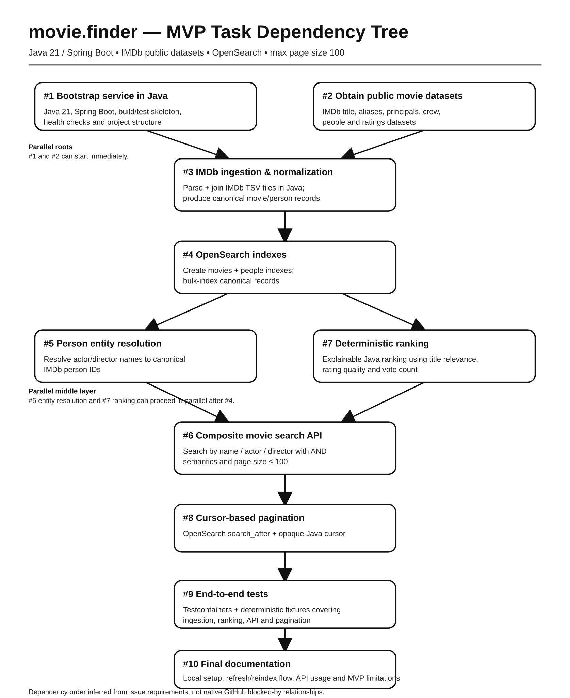

# movie.finder

A personal movie recommendation and discovery service built in **Java**.

The MVP focuses on finding and ranking movies from public datasets using a combination of:

- movie name
- actor / actress
- director

Studio search, collaborative filtering, embeddings, vector databases, and LLM-based retrieval are intentionally out of scope for the first version.

## MVP goal

Given one or more movie attributes, return a ranked and paginated list of matching movie recommendations.

Examples:

- movies named `Inception`
- movies featuring `Leonardo DiCaprio`
- movies directed by `Christopher Nolan`
- movies featuring `Leonardo DiCaprio` **and** directed by `Christopher Nolan`
- movies matching a title, actor, and director at the same time

The maximum response page size is **100 movies**.

## Technology

The implementation should be Java-first end to end.

Suggested baseline:

- **Java 21**
- **Spring Boot** for the HTTP API and application lifecycle
- **OpenSearch** for entity lookup, movie retrieval, ranking, and cursor pagination
- **JUnit 5** for tests
- **Testcontainers** for OpenSearch integration and end-to-end tests
- Gradle or Maven as the build tool

## Public movie data

The MVP uses the public IMDb datasets as the source for movie, person, crew, alias, and rating information.

Relevant datasets:

- `title.basics.tsv.gz`
- `title.akas.tsv.gz`
- `title.principals.tsv.gz`
- `title.crew.tsv.gz`
- `name.basics.tsv.gz`
- `title.ratings.tsv.gz`

The ingestion process should extract only the columns needed by the application and transform the source files into canonical movie and person records.

IMDb dataset licensing and usage constraints must be documented before the data is used outside development or evaluation environments.

## High-level architecture

```text
IMDb public datasets
        |
        v
Java ingestion pipeline
        |
        | parse / filter / join / normalize
        v
Canonical movie + person records
        |
        v
OpenSearch
  |                 |
  |                 |
people index     movies index
  |                 |
  +--------+--------+
           |
           v
Java search service
  |
  +-- entity resolution
  +-- candidate retrieval
  +-- deterministic ranking
  +-- cursor pagination
           |
           v
Spring Boot API
```

The service is primarily a **retrieval and ranking engine** for the MVP rather than a machine-learning recommender.

## Canonical data model

A movie record should contain enough denormalized information to answer searches without runtime joins.

Example:

```json
{
  "id": "tt1375666",
  "title": "Inception",
  "aliases": ["A Origem"],
  "year": 2010,
  "castIds": ["nm0000138"],
  "castNames": ["Leonardo DiCaprio"],
  "directorIds": ["nm0634240"],
  "directorNames": ["Christopher Nolan"],
  "genres": ["Action", "Sci-Fi", "Thriller"],
  "rating": 8.8,
  "voteCount": 2700000
}
```

Person records should at minimum contain:

- IMDb person ID
- primary name
- normalized name
- known-for movie IDs where useful

## Ingestion pipeline

The Java ingestion pipeline is responsible for turning the IMDb TSV files into the documents used by the search engine.

At a high level it should:

1. download or locate the configured IMDb dataset files
2. stream and parse compressed TSV input
3. filter out records that are irrelevant to the MVP
4. join titles, aliases, principals, crew, people, and ratings
5. normalize missing values and malformed records
6. produce deterministic canonical movie and person records
7. bulk-index those records into OpenSearch

The import must be safe to rerun and should emit basic metrics such as records read, accepted, rejected, indexed, and total duration.

## Search model

The MVP should maintain two primary OpenSearch indexes.

### `people`

Used to resolve human-entered actor and director names into canonical IMDb person IDs.

Important fields include:

- `personId`
- `name`
- `normalizedName`
- optional aliases / known-for titles

### `movies`

Used for candidate retrieval and ranking.

Important fields include:

- `movieId`
- `title`
- `aliases`
- `year`
- `castIds`
- `castNames`
- `directorIds`
- `directorNames`
- `genres`
- `rating`
- `voteCount`

IDs should be indexed as exact-match keyword fields. Names and titles should have text analyzers suitable for case-insensitive lookup, prefix matching, aliases, and limited typo tolerance.

## Entity resolution

Actor and director queries should be resolved before querying the movie index.

For example:

```text
"leo dicaprio"
      |
      v
people index
      |
      v
Leonardo DiCaprio
nm0000138
      |
      v
movies.castIds = nm0000138
```

This prevents every movie query from performing fuzzy text matching against cast or director names.

Entity resolution should support:

- exact matches
- case-insensitive normalized matches
- prefix matches
- limited fuzziness for minor typos
- explicit handling of ambiguous names

## Composite queries

Different supplied attribute types use **AND semantics** in the MVP.

A request containing:

```json
{
  "name": "Inception",
  "actors": ["Leonardo DiCaprio"],
  "directors": ["Christopher Nolan"]
}
```

means:

```text
title matches Inception
AND
cast contains Leonardo DiCaprio
AND
director contains Christopher Nolan
```

Missing attributes are simply ignored.

A suggested API shape is:

```http
POST /v1/movies/search
```

```json
{
  "name": "Inception",
  "actors": ["Leonardo DiCaprio"],
  "directors": ["Christopher Nolan"],
  "pageSize": 100,
  "cursor": null
}
```

A response should expose stable movie information together with pagination metadata:

```json
{
  "items": [
    {
      "id": "tt1375666",
      "title": "Inception",
      "year": 2010,
      "rating": 8.8,
      "voteCount": 2700000
    }
  ],
  "nextCursor": "..."
}
```

## Candidate retrieval and ranking

The MVP does not require machine learning.

OpenSearch should first retrieve movies matching the supplied filters. The resulting candidates should then be ranked deterministically and explainably.

Ranking should prioritize roughly:

1. exact title match
2. title or alias relevance
3. actor/director relevance
4. rating quality
5. vote count / popularity

Raw IMDb rating should not be used by itself because a movie with very few votes can otherwise outrank a well-established movie unfairly.

A Bayesian or weighted-rating component can be used to combine average rating and vote count.

The ranking function and weights should remain explicit, configurable, and covered by tests.

## Pagination

Search results must support a maximum page size of **100**.

The API should use cursor-based pagination rather than deep offset pagination.

OpenSearch `search_after` should be used with a stable sort order and deterministic tie-breaker, such as movie ID.

The public cursor should be opaque to callers and contain the sort state required to resume the query.

## Testing strategy

Tests should cover the complete path from normalized fixture data to API responses.

The project should include:

- unit tests for normalization and ranking
- unit tests for cursor serialization
- integration tests for OpenSearch mappings and queries
- entity-resolution tests
- API tests for title-only, actor-only, director-only, and composite queries
- end-to-end tests using Testcontainers
- pagination tests verifying no duplicate or missing records across pages

## MVP boundaries

The following are explicitly **not required** for the first version:

- studio / production-company search
- Wikidata or TMDB enrichment
- collaborative filtering
- MovieLens integration
- user-profile recommendations
- embeddings
- vector search
- LLM query parsing
- graph databases
- Kafka or event streaming

Those features can be evaluated after the basic retrieval, ranking, and data-quality pipeline is proven useful.

## Task dependency tree



The dependency graph represents the intended implementation sequence for the current MVP backlog.
